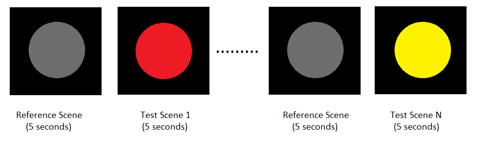

<!-- .slide: data-background="media/imgs/aframe.jpg" -->

  <h1>VR for Color Science</h1>
  
Supervisor: Dr. Frédéric Leloup 

  

    Light&Lighting Lab | KU Leuven | @jojo96(GitHub)
  

<!-- NOTES -->
- Onboard web developers into the 3D and VR world with easy-to-use tools
- Prototype WebVR experiences faster

------

# Virtual Reality

<!-- .slide: data-background-video="media/video/virtualreality.mp4" data-background-video-loop="true" data-background-video-muted="true" data-state="state--bg-dark" -->

<!-- NOTES -->
- Ask how many have tried VR.
- Virtual reality is a technology platform that transports you to realistic, interactive, immersive 3D environments
- It's the next platform, will change how we work + play + communicate digitally, face of society

---

  

  

  

  

  

  

<!-- NOTES -->
- Backed by the largest corporations in the world, everyone wants in
- Range from cheap to expensive, tethered and untethered, controllers, tracking
- HTC Vive with Steam currently offers the most compelling experiences, but never know
- See a lot of different devices, systems, platforms competing against each other...

---

## Friction of VR Ecosystems

  

    
    <i>Gatekeepers</i>
  

  

    
    <i>Installs</i>
  

  

    
    <i>Closed</i>
  

<!-- NOTES -->
- App stores and corporations control distribution: can take down or block content
- Downloads / installs are a barrier to consumption: small business pages
- Closed ecosystem: proprietary engines, steep learning curves, siloed experiences, fragmentation
- We want VR to be successful, so we want a platform without these points of friction. The answer is WebVR...

------

# Virtual Reality

**VR** is all around us (not as much as reality)

  

    
    <i>Almost everywhere</i>
  

  

    
    <i>Long history</i>
  

  

    
    <i>Lots of applications</i>
  

<!-- NOTES -->
WebVR is...virtual reality in the browser, powered by the Internet

Open:
- Anyone can publish
- Open source culture with open standards

Connected:
- Traverse worlds

Instant:
- Click a link on Twitter or Weibo, immediate VR experiences
- No installs
- Imagine for long tail experiences: shopping & personal spaces
- Great for long tail bite-sized experiences

Transition:
- Web has advantages that make it the best platform for the people
- Need to act to make it reality, can't wait for VR to bake and crystallize
- Get involved
------

# Research Objectives

  

    VR as next generation research tool:
  

  <ul class="objectives-list">
    <li>
      to study color perception in both virtual and real environments
    </li>
     <li>
      to study chromatic adaptation and simultaneous contrast
    </li>
    <li>
      to develop new color appearance models 
    </li>
  </ul>

---

------

# Color Characterization

**HMDs** (Sometimes, we need to check if the colors are ok)

  

    
    <i>Meta Quest 2</i>
  

  

    
    <i>Meta Quest Pro</i>
  

---

------

# Characterization Pipeline

**** 

  

    
    <i>Step-by-step process</i>
  

---

------

# Characterization Results

**Some results** (Nice graphs)

  

    
    <i>Characterization results</i>
  

---

------

# Color effects

  

    
    <i>Helmholtz–Kohlrausch effect</i>
  

---

------

# HK effect

Experiments

  

    
    <i>HK effect</i>
  

  

    
    <i>Control</i>
  

---

------

# Simultaneous Contrast

Colors have their personalities

  

    
    <i></i>
  

  

    
    <i></i>
  

---

